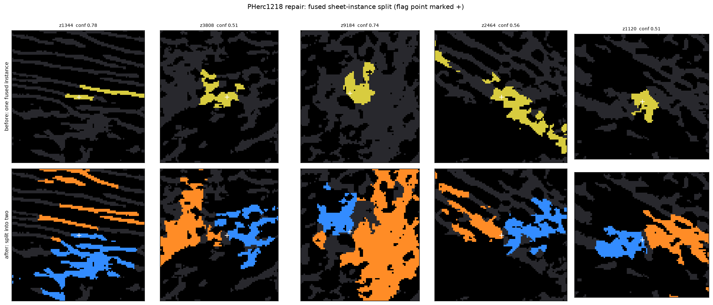

# unmerge-cli

Splits fused papyrus sheet instances in compressed regions of Herculaneum scroll
data, where two sheets sit under 4 voxels apart and every segmentation model
labels them as one.



Top row: a fused instance (yellow) with the flag point marked. Bottom row: the
two instances its voxels were split between. From the PHerc1218 run below.

Where two sheets are in physical contact the CT carries no intensity boundary
between them, so no intensity-based method can separate them at any threshold or
scale ([measured here](https://github.com/Jinhojeong/vesuvius-surface-geometry-diagnostic)).
This tool does what annotators do instead: it carries sheet identity in from the
surroundings where the sheets are still resolved, using an anisotropic
random-walk solve whose conductance is suppressed across the contact. When a
site cannot be resolved that way it is flagged rather than guessed.

## Install and run

```bash
pip install git+https://github.com/Jinhojeong/vesuvius-unmerge

# one contact point, Khartes X Y Z order
unmerge --volume mask.tif --click 2450 1320 890 --out out/

# a batch of candidates
unmerge --volume mask.tif --candidates points.json --out out/
```

Outputs are Wavefront `.obj` in global volume coordinates: `Sheet_A_*.obj` and
`Sheet_B_*.obj` when the split is accepted, or a marker (`WELD_FLAG_*.obj`,
`DISCONNECTED_GRAPH_FLAG_*.obj`) naming why it was not. `report.json` carries the
decision and confidence margin per site.

## What it does on real data

Applied to the published 686k-instance PHerc1218 sheet-instance labels, it
repaired 14,131 fused sites across 1,369 tiles and reassigned 48.6M voxels; a
ray recast at every site confirms 78.8% of the conservative tier now cross two
instances at the weld where they crossed one before. The result is published as
[pherc1218-topological-repair](https://www.kaggle.com/datasets/jhjeong0815/pherc1218-topological-repair)
and listed as a companion dataset by
[vesuvius-sheet-tools](https://github.com/IyanDopico/vesuvius-sheet-tools).

One scope note worth reading before use: the method seeds from neighbouring
instance labels, so it refines a segmentation that already has label
granularity. On raw coarse predictions it moves the fused share by about a
point, against 16.7 for an intensity-based splitter on the same crop. It is a
refiner, not a bootstrap.

---

## 1. Input Formats

You can run the CLI against a volume in two modes:

### Single Click (Interactive Mode)
Provide an ambiguous contact point $(X, Y, Z)$ directly. This is useful when you spot a merged bridge while manually tracing in Khartes.
```bash
unmerge --volume mask.tif --click 2450 1320 890 --out out/
```

### Batch Candidate Mode
Run the tool against a batch of candidate locations automatically generated by `qc192_labels.py` (or any other bounding box list).
```bash
unmerge --volume mask.tif --candidates points.json --out out/
```
`points.json` is a JSON list of `[X, Y, Z]` points. Volumes are `.tif` or
`.npy` (Z-Y-X arrays); probability volumes are thresholded with `--thr`
(default 0.6). Zarr input is planned for v1.

---

## 2. Output and Flag Semantics

For every processed site, the CLI will output `.obj` files to the output directory. Depending on the ADL-RW solver's confidence ($\Delta \Phi$), it emits either separated meshes or a standardized flag marker.

### **Success State**
- `Sheet_A.obj` & `Sheet_B.obj`: Two separated 3D meshes (or point clouds for ultra-thin sheets). **Action**: Import directly to Khartes.

### **Flag States (Octahedron Markers)**
If the solver is uncertain, it will not guess. Instead, it emits a standardized 3D octahedron marker at the input point with a specific semantic name:

- `WELD_FLAG_LOW_MARGIN.obj`: The solver successfully ran, but the confidence margin ($\Delta \Phi < 0.10$) was too low. The identities of the two sheets are too blended at this location.
- `WELD_FLAG_STARVED_PERIPHERY.obj`: Fewer than 5 rays in the seed ring crossed two distinct sheet runs, which is the minimum the solve seeds from (`MIN_SEED_RAYS` in `core.py`, reported per site as `n_seed_rays`). Too little of the periphery separates into two sheets to anchor the solve.
- `WELD_FLAG_NO_EVAL_RAYS.obj`: Seeds were found, but the core contact bridge lacks valid internal evaluation rays to measure the margin.
- `WELD_FLAG_SOLVE_FAILED.obj`: The linear solve did not return a usable potential field at all, so no margin could be read.
- `DISCONNECTED_GRAPH_FLAG.obj`: The internal topological graph is shattered (e.g., thin shell fragmentation). The Conjugate Gradient solver returned `NaN`. 

**Action for all Flags**: The 3D marker tells the annotator exactly where the algorithm gave up. Load the flag into Khartes, navigate to the marker, and **manually trace the topological continuity from outside the crop**.

---

## 3. Khartes Import Steps

All outputs are standard Wavefront `.obj` files in global volume coordinates.

To load the outputs:

1. Open Khartes and load your scroll volume.
2. Import the generated `Sheet_A_*.obj` / `Sheet_B_*.obj` or `*_FLAG_*.obj`
   files with Khartes' .obj import (supported natively; see the Khartes
   README for the exact menu location in your version).
3. Flag markers are small octahedra at the ambiguous weld point — navigate
   to the marker and trace the continuity manually from outside the crop.


---

## 4. Validation summary (2026-07-18, Dataset059)

- GT-quality masks (annotation-workflow case), 8 volumes / 65 merged sites:
  25% auto-split, 98.4% observed ray accuracy (61/62) at accepted sites,
  75% honestly flagged.
- Raw model predictions (ft_full on the Kaggle competition holdout volumes,
  not Dataset059): every true-weld site the tool was pointed at came back
  refused (flagged), with zero false splits. This was two passes over the same
  volumes, 7 sites under naive seeding and 12 under strong-threshold seeding,
  so read it as 12 sites rather than 19. Model probabilities carry no weld
  boundary information (0.67-1.0 across the weld), so on predictions the
  tool is a weld flagger by design, not a splitter.
- Background and the full diagnostic chain: https://github.com/Jinhojeong/vesuvius-surface-geometry-diagnostic
